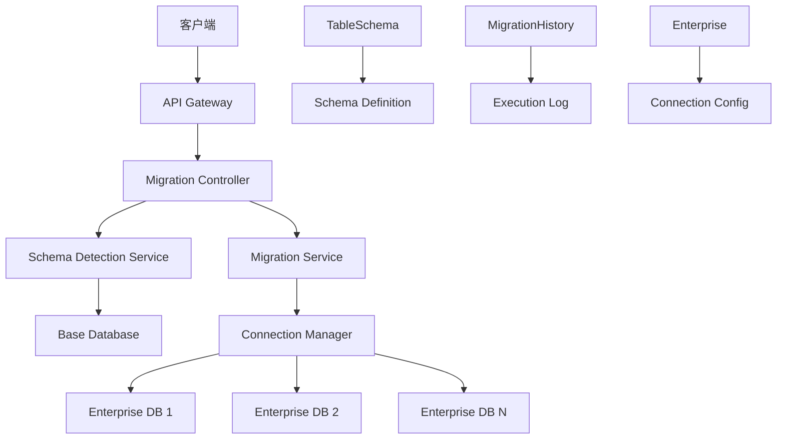
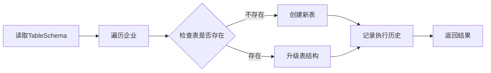

# 🚀 MySQL 多租户数据库自动升级系统

[](https://nodejs.org/)
[](https://www.typescriptlang.org/)
[](https://www.mysql.com/)
[](https://www.docker.com/)
[](https://opensource.org/licenses/MIT)

基于 Node.js 和 TypeScript 的企业级多租户数据库自动升级系统，支持表结构版本化管理、智能检测变更、自动迁移、分区表支持等功能。支持基于基准库的自动检测，自动生成升级版本，自动迁移的数据库升级拒绝方案。

## 📋 目录

- [功能特性](#-功能特性)
- [系统架构](#-系统架构)
- [快速开始](#-快速开始)
- [API 接口](#-api-接口)
- [表结构检测](#-表结构检测)
- [迁移执行](#-迁移执行)
- [分区表支持](#-分区表支持)
- [配置说明](#-配置说明)
- [开发指南](#-开发指南)
- [故障排除](#-故障排除)
- [贡献指南](#-贡献指南)

## ✨ 功能特性

### 🏢 多租户架构

- **企业级多租户支持**：每个企业独立数据库配置
- **动态连接管理**：智能连接池管理，支持连接复用
- **自动数据库创建**：企业数据库不存在时自动创建

### 📊 表结构管理

- **版本化管理**：表结构定义支持版本控制和历史追踪
- **智能检测**：自动检测表结构变更，支持新增、修改、删除
- **一键迁移**：支持批量迁移所有表，提供详细执行报告

### 🔄 迁移系统

- **统一迁移逻辑**：智能判断创建/升级操作，避免重复执行
- **安全升级**：只添加缺失的列和索引，不删除现有数据
- **执行历史记录**：完整记录所有 SQL 执行历史和状态

### 📈 分区表支持

- **门店分表**：按门店自动创建分表 `table_store_{store_id}`
- **时间分表**：按时间周期创建分表，支持年/月/日格式
- **混合分区**：支持复杂的分区策略组合

### 🛡️ 安全可靠

- **事务支持**：关键操作使用数据库事务保证一致性
- **错误处理**：完善的错误处理和回滚机制
- **日志记录**：详细的操作日志和审计跟踪

## 🏗️ 系统架构



### 核心组件

| 组件                          | 职责       | 描述                             |
| ----------------------------- | ---------- | -------------------------------- |
| **SchemaDetectionService**    | 表结构检测 | 对比基准库和配置，检测表结构变更 |
| **DatabaseMigrationService**  | 迁移执行   | 执行表创建、升级、删除操作       |
| **DatabaseConnectionManager** | 连接管理   | 管理多租户数据库连接池           |
| **MigrationController**       | API 控制器 | 提供 RESTful API 接口            |
| **TableSchema Model**         | 表结构定义 | 存储表结构版本和配置             |
| **MigrationHistory Model**    | 执行历史   | 记录 SQL 执行历史和状态          |

## 🚀 快速开始

### 🐳 Docker 部署（推荐）

使用 Docker 可以快速部署完整的服务：

```bash
# 1. 克隆项目
git clone https://github.com/Qiutianxiaxue/mysqlupdate.git
cd mysqlupdate

# 2. 一键启动
./docker-start.sh

# 或者手动启动
cp docker.env .env
docker compose up -d
```

**服务地址：**

- 🌐 应用服务：http://localhost:3000
- 💓 健康检查：http://localhost:3000/health
- 🗄️ 主数据库：localhost:3306
- 📊 基准数据库：localhost:3307

> 📖 详细的 Docker 部署指南请参考：[DOCKER.md](./DOCKER.md)

### 💻 本地开发部署

#### 环境要求

- Node.js 20.0+
- MySQL 5.7+ / 8.0+
- TypeScript 4.5+

#### 安装步骤

```bash
# 1. 安装依赖
npm install

# 2. 配置环境变量
cp env.example .env
# 编辑 .env 文件配置数据库连接

# 3. 启动服务
npm run dev  # 开发模式（热更新）
# 或
npm run build && npm start  # 生产模式
```

#### 环境配置示例

```env
# 应用配置
PORT=3000
NODE_ENV=development

# 主数据库配置（存储系统元数据）
DB_HOST=localhost
DB_PORT=3306
DB_USERNAME=root
DB_PASSWORD=123456
DB_NAME=mysql_update

# 基准数据库配置（表结构检测参考）
BASE_DB_HOST=localhost
BASE_DB_PORT=3307
BASE_DB_USERNAME=base_user
BASE_DB_PASSWORD=base_password
BASE_DB_NAME=base_schema_database
```

## 📡 API 接口

### 🔍 表结构检测

#### 检测所有表变更

```http
POST /api/schema-detection/detect-all
```

**响应示例：**

```json
{
  "success": true,
  "data": {
    "summary": {
      "total_tables": 15,
      "new_tables": 2,
      "changed_tables": 1,
      "deleted_tables": 0,
      "unchanged_tables": 12
    },
    "database_types": {
      "main": { "new": 1, "changed": 1, "deleted": 0 },
      "log": { "new": 1, "changed": 0, "deleted": 0 }
    }
  }
}
```

#### 检测特定表变更

```http
POST /api/schema-detection/detect
Content-Type: application/json

{
  "table_name": "users",
  "database_type": "main"
}
```

#### 检测并保存结果

```http
POST /api/schema-detection/detect-and-save
```

### 🔄 迁移执行

#### 一键迁移所有表

```http
POST /api/migration/execute-all
```

**响应示例：**

```json
{
  "success": true,
  "data": {
    "summary": {
      "total_tables": 5,
      "successful_migrations": 4,
      "failed_migrations": 1,
      "total_enterprises": 3
    },
    "results": [
      {
        "table_name": "users",
        "database_type": "main",
        "success": true,
        "enterprises_processed": 3
      }
    ]
  }
}
```

#### 执行特定表迁移

```http
POST /api/migration/execute
Content-Type: application/json

{
  "table_name": "users",
  "database_type": "main",
  "partition_type": "store",
  "schema_version": "1.2.0"  // 可选，默认使用最新版本
}
```

### 📋 表结构定义管理

#### 创建表结构定义

```http
POST /api/migration/schemas
Content-Type: application/json

{
  "table_name": "users",
  "database_type": "main",
  "schema_version": "1.0.0",
  "schema_definition": {
    "tableName": "users",
    "columns": [
      {
        "name": "user_id",
        "type": "BIGINT",
        "primaryKey": true,
        "autoIncrement": true,
        "allowNull": false,
        "comment": "用户ID"
      },
      {
        "name": "username",
        "type": "VARCHAR",
        "length": 50,
        "allowNull": false,
        "unique": true,
        "comment": "用户名"
      }
    ],
    "indexes": [
      {
        "name": "idx_username",
        "fields": ["username"],
        "unique": true
      }
    ]
  },
  "is_active": true,
  "upgrade_notes": "初始版本创建用户表"
}
```

#### 获取表结构历史

```http
GET /api/migration/schemas/history?table_name=users&database_type=main
```

#### 更新表结构定义

```http
PUT /api/migration/schemas/{id}
Content-Type: application/json

{
  "schema_version": "1.1.0",
  "schema_definition": { /* 更新后的表结构 */ },
  "upgrade_notes": "添加邮箱字段"
}
```

### 🏢 企业管理

#### 创建企业

```http
POST /api/migration/enterprises
Content-Type: application/json

{
  "enterprise_key": "company001",
  "enterprise_name": "示例公司",
  "database_name": "company001_db",
  "database_hostname": "localhost",
  "database_port": 3306,
  "database_username": "company001_user",
  "database_password": "secure_password"
}
```

#### 获取企业列表

```http
GET /api/migration/enterprises
```

### 📊 迁移历史

#### 获取迁移历史

```http
GET /api/migration/history?table_name=users&enterprise_key=company001&limit=50
```

#### 获取执行统计

```http
GET /api/migration/history/stats
```

### 🔧 系统管理

#### 健康检查

```http
GET /health
```

#### 连接池状态

```http
GET /api/migration/connections/stats
```

#### 关闭所有连接

```http
POST /api/migration/connections/close
```

## 🔍 表结构检测

### 检测原理

系统通过对比基准数据库和 TableSchema 配置来检测表结构变更：

1. **基准数据库**：存储标准的表结构定义
2. **TableSchema 配置**：系统中配置的表结构版本
3. **智能对比**：检测新增、修改、删除的表

### 检测类型

| 检测类型   | 描述                                 | 处理方式       |
| ---------- | ------------------------------------ | -------------- |
| **新表**   | 基准库存在但 TableSchema 中无记录    | 自动生成配置   |
| **删除表** | TableSchema 中有记录但基准库中不存在 | 生成删除配置   |
| **变更表** | 表结构有差异                         | 生成升级配置   |
| **分区表** | 支持门店分表和时间分表检测           | 按分区规则检测 |

### 使用示例

```bash
# 检测所有表变更
curl -X POST http://localhost:3000/api/schema-detection/detect-all

# 检测并自动保存配置
curl -X POST http://localhost:3000/api/schema-detection/detect-and-save

# 检测特定表
curl -X POST http://localhost:3000/api/schema-detection/detect \
  -H "Content-Type: application/json" \
  -d '{"table_name": "users", "database_type": "main"}'
```

## 🔄 迁移执行

### 迁移流程



### 安全机制

- **只增不减**：只添加缺失的列和索引，不删除现有结构
- **事务保护**：关键操作使用数据库事务
- **错误回滚**：出错时自动回滚已执行的操作
- **执行记录**：完整记录所有 SQL 执行历史

### 使用示例

```bash
# 一键迁移所有表
curl -X POST http://localhost:3000/api/migration/execute-all

# 迁移特定表（使用最新版本）
curl -X POST http://localhost:3000/api/migration/execute \
  -H "Content-Type: application/json" \
  -d '{"table_name": "users", "database_type": "main"}'

# 迁移特定版本
curl -X POST http://localhost:3000/api/migration/execute \
  -H "Content-Type: application/json" \
  -d '{"table_name": "users", "database_type": "main", "schema_version": "1.2.0"}'
```

## 📊 分区表支持

### 门店分表

按门店 ID 创建分表，格式：`{table_name}{store_id}`

```json
{
  "table_name": "orders",
  "database_type": "order",
  "partition_type": "store",
  "schema_definition": {
    "tableName": "orders",
    "columns": [
      /* 列定义 */
    ]
  }
}
```

### 时间分表

按时间周期创建分表，支持多种时间格式：

```json
{
  "table_name": "system_logs",
  "database_type": "log",
  "partition_type": "time",
  "time_interval": "month",
  "time_start_date": "2024-01-01",
  "time_end_date": "2024-12-31",
  "time_format": "_YYYY_MM"
}
```

**支持的时间格式：**

- `_YYYY`：按年分表，如 `logs_2024`
- `_MM`：按月分表，如 `logs_01`
- `_DD`：按日分表，如 `logs_01`
- `_YYYY_MM`：按年月分表，如 `logs_2024_01`

### 删除表支持

支持删除表操作，通过配置 `action: "DROP"` 实现：

```json
{
  "table_name": "old_table",
  "database_type": "main",
  "schema_definition": {
    "action": "DROP"
  }
}
```

## ⚙️ 配置说明

### 表结构定义格式

```json
{
  "tableName": "users",
  "columns": [
    {
      "name": "user_id",
      "type": "BIGINT",
      "primaryKey": true,
      "autoIncrement": true,
      "allowNull": false,
      "comment": "用户ID"
    },
    {
      "name": "email",
      "type": "VARCHAR",
      "length": 100,
      "allowNull": true,
      "defaultValue": null,
      "comment": "邮箱地址"
    },
    {
      "name": "create_time",
      "type": "TIMESTAMP",
      "allowNull": false,
      "defaultValue": "CURRENT_TIMESTAMP",
      "comment": "创建时间"
    },
    {
      "name": "update_time",
      "type": "TIMESTAMP",
      "allowNull": false,
      "defaultValue": "CURRENT_TIMESTAMP ON UPDATE CURRENT_TIMESTAMP",
      "comment": "更新时间"
    }
  ],
  "indexes": [
    {
      "name": "idx_email",
      "fields": ["email"],
      "unique": true
    },
    {
      "name": "idx_create_time",
      "fields": ["create_time"]
    }
  ]
}
```

### 支持的数据类型

| 类型        | 说明           | 示例            |
| ----------- | -------------- | --------------- |
| `VARCHAR`   | 可变长度字符串 | `VARCHAR(255)`  |
| `INT`       | 整数           | `INT`           |
| `BIGINT`    | 长整数         | `BIGINT`        |
| `TINYINT`   | 小整数         | `TINYINT(1)`    |
| `DECIMAL`   | 定点数         | `DECIMAL(10,2)` |
| `TEXT`      | 长文本         | `TEXT`          |
| `JSON`      | JSON 数据      | `JSON`          |
| `TIMESTAMP` | 时间戳         | `TIMESTAMP`     |
| `DATETIME`  | 日期时间       | `DATETIME`      |
| `DATE`      | 日期           | `DATE`          |

### 特殊默认值

- `CURRENT_TIMESTAMP`：当前时间戳
- `CURRENT_TIMESTAMP ON UPDATE CURRENT_TIMESTAMP`：创建和更新时间戳
- `NULL`：空值
- 字符串值：需要用引号包围

## 🛠️ 开发指南

### 项目结构

```
mysqlupdate/
├── src/                          # 源代码目录
│   ├── app.ts                   # Express应用主文件
│   ├── index.ts                 # 应用入口文件
│   ├── config/                  # 配置文件
│   │   ├── database.ts         # 数据库配置
│   │   └── baseDatabase.ts     # 基准数据库配置
│   ├── controllers/             # 控制器
│   │   ├── MigrationController.ts
│   │   └── SchemaDetectionController.ts
│   ├── models/                  # 数据模型
│   │   ├── Enterprise.ts       # 企业模型
│   │   ├── TableSchema.ts      # 表结构定义模型
│   │   ├── MigrationHistory.ts # 迁移历史模型
│   │   └── index.ts
│   ├── routes/                  # 路由定义
│   │   ├── migration.ts
│   │   └── schemaDetection.ts
│   ├── services/                # 业务服务
│   │   ├── DatabaseConnectionManager.ts
│   │   ├── DatabaseMigrationService.ts
│   │   └── SchemaDetectionService.ts
│   └── utils/                   # 工具类
│       └── logger.ts
├── scripts/                     # 脚本文件
├── logs/                        # 日志目录
├── docker-compose.yml          # Docker编排文件
├── Dockerfile                  # Docker镜像文件
├── DOCKER.md                   # Docker部署文档
├── package.json                # 项目配置
├── tsconfig.json              # TypeScript配置
└── README.md                   # 项目文档
```

### 开发环境设置

```bash
# 1. 安装依赖
npm install

# 2. 启动开发服务器
npm run dev

# 3. 构建项目
npm run build

# 4. 运行测试
npm test

# 5. 代码格式化
npm run format

# 6. 代码检查
npm run lint
```

### 添加新功能

1. **添加新的表结构定义**

   ```bash
   # 创建表结构定义
   curl -X POST http://localhost:3000/api/migration/schemas \
     -H "Content-Type: application/json" \
     -d @new-table-schema.json
   ```

2. **执行迁移**

   ```bash
   # 执行特定表迁移
   curl -X POST http://localhost:3000/api/migration/execute \
     -H "Content-Type: application/json" \
     -d '{"table_name": "new_table", "database_type": "main"}'
   ```

3. **验证结果**
   ```bash
   # 检查迁移历史
   curl http://localhost:3000/api/migration/history?table_name=new_table
   ```

### 代码规范

- 使用 TypeScript 严格模式
- 遵循 ESLint 配置规则
- 使用 Prettier 格式化代码
- 编写单元测试覆盖核心功能
- 添加详细的代码注释

## 🔧 故障排除

### 常见问题

#### 1. 数据库连接失败

**症状：** 服务启动时报数据库连接错误

**解决方案：**

```bash
# 检查数据库服务状态
systemctl status mysql  # Linux
brew services list | grep mysql  # macOS

# 检查连接配置
cat .env | grep DB_

# 测试连接
mysql -h localhost -u root -p
```

#### 2. 表结构检测异常

**症状：** 检测接口返回错误或结果不准确

**解决方案：**

```bash
# 检查基准数据库连接
curl http://localhost:3000/health

# 查看详细日志
tail -f logs/app.log

# 手动检测特定表
curl -X POST http://localhost:3000/api/schema-detection/detect \
  -H "Content-Type: application/json" \
  -d '{"table_name": "problem_table", "database_type": "main"}'
```

#### 3. 迁移执行失败

**症状：** 迁移过程中出现 SQL 错误

**解决方案：**

```bash
# 查看迁移历史
curl http://localhost:3000/api/migration/history?table_name=failed_table

# 检查SQL语法
# 查看日志中的具体SQL语句

# 手动验证SQL
mysql -h localhost -u root -p -e "DESCRIBE failed_table;"
```

#### 4. Docker 部署问题

**症状：** Docker 容器启动失败

**解决方案：**

```bash
# 查看容器状态
docker compose ps

# 查看容器日志
docker compose logs app
docker compose logs mysql

# 重建容器
docker compose down
docker compose up -d --build
```

### 日志分析

系统提供详细的日志记录：

```bash
# 查看应用日志
tail -f logs/app.log

# 查看错误日志
grep "ERROR" logs/app.log

# 查看特定表的操作日志
grep "table_name" logs/app.log
```

### 性能优化

1. **连接池优化**

   ```env
   # 调整连接池大小
   DB_CONNECTION_LIMIT=10
   DB_TIMEOUT=60000
   ```

2. **批量操作优化**

   ```bash
   # 使用一键迁移而不是逐个迁移
   curl -X POST http://localhost:3000/api/migration/execute-all
   ```

3. **索引优化**
   - 为经常查询的字段添加索引
   - 避免过多的复合索引

## 🤝 贡献指南

我们欢迎所有形式的贡献！

### 如何贡献

1. **Fork 项目**
2. **创建功能分支** (`git checkout -b feature/AmazingFeature`)
3. **提交更改** (`git commit -m 'Add some AmazingFeature'`)
4. **推送分支** (`git push origin feature/AmazingFeature`)
5. **创建 Pull Request**

### 开发规范

- 遵循现有的代码风格
- 添加适当的测试用例
- 更新相关文档
- 确保所有测试通过

### 报告问题

如果您发现了 bug 或有功能建议：

1. 检查是否已有相关 issue
2. 创建新的 issue，提供详细信息
3. 包含复现步骤和环境信息

## 📄 许可证

本项目采用 MIT 许可证 - 查看 [LICENSE](LICENSE) 文件了解详情。

## 🙏 致谢

感谢所有为这个项目做出贡献的开发者！

---

<div align="center">

**如果这个项目对您有帮助，请给我们一个 ⭐️！**

[报告问题](../../issues) · [功能建议](../../issues) · [贡献代码](../../pulls)

</div>
